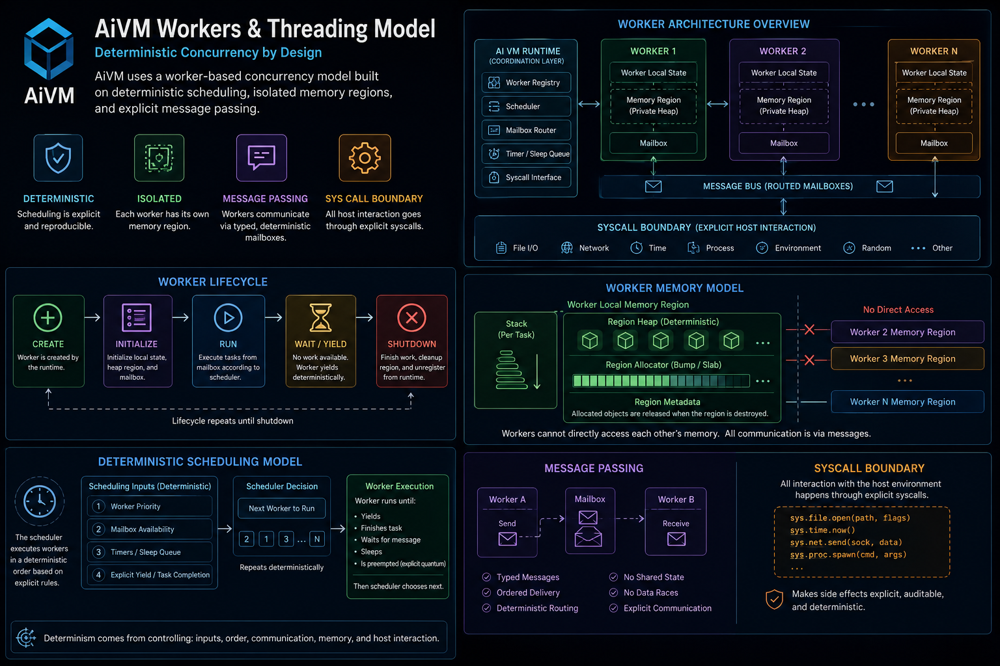

# Workers Without Hidden Threads: AiVM's Deterministic Concurrency Model



AiVM is not trying to pretend concurrency does not exist.

Modern applications need to do many things at once:
- fetch data,
- read and write files,
- handle UI events,
- accept network connections,
- run background work,
- coordinate external processes,
- keep interfaces responsive.

But AiVM is also not willing to trade deterministic language behavior for convenient hidden threading.

The goal is not “no concurrency.”

The goal is:

> Concurrent host execution, deterministic language-visible behavior.

That distinction drives the worker and threading design.

---

## The Core Rule

AiLang and AiVM maintain a single-owner semantic model.

The evaluator owns language-visible state.

Workers may exist.

Host threads may overlap.

External operations may complete at different times.

But VM state transitions happen through one deterministic owner path.

In practical terms:

```text
Host threads may do work.
Workers may complete in any order.
The evaluator decides when completion becomes visible.
```

That gives AiVM a clean separation between:
- physical execution,
- semantic observation.

The host can use native concurrency as an implementation detail, while AiLang semantics remain deterministic.

---

## Why Not User-Level Threads?

AiLang’s IL contract deliberately avoids user-visible threading primitives.

There are no user-level:
- thread objects,
- mutexes,
- locks,
- ambient schedulers.

That is intentional.

Traditional thread models expose too much nondeterminism directly into application semantics. Once shared mutable state and locks enter the language core, behavior can depend on timing, interleaving, scheduling, platform details, and runtime implementation choices.

AiVM avoids that path.

Instead, it exposes structured async work and worker handles.

The language sees:
- a handle,
- a status,
- a result,
- an error,
- a cancellation transition.

It does not see a raw thread.

---

## The Worker Syscall Surface

The Phase 1 worker surface is intentionally small:

```text
sys.worker.start(taskName, payload) -> workerHandle
sys.worker.poll(workerHandle) -> status
sys.worker.result(workerHandle) -> string
sys.worker.error(workerHandle) -> string
sys.worker.cancel(workerHandle) -> bool
```

The important part is not just the shape of the API.

The important part is the model behind it.

A worker is an effectful host operation with owner-thread-visible completion.

The host may run worker work on another thread.

The worker may finish earlier or later depending on host scheduling.

But the result becomes visible to AiLang only when the evaluator explicitly polls or reads it.

That keeps completion observation deterministic.

---

## Worker Status Values

Worker polling uses a stable integer status contract:

```text
 0  pending
 1  completed-success
-1  completed-failure
-2  canceled
-3  unknown-handle
```

This makes worker state explicit.

There is no implicit exception crossing from host thread to evaluator state.

There is no hidden callback mutating program state.

There is no background continuation that silently resumes execution.

The evaluator asks a question:

```text
What is the current status of this handle?
```

Then it decides what to do next.

---

## Deterministic Completion Observation

One of the most important rules is:

> Completion timing is not semantic ordering.

If two workers finish at almost the same time, host scheduling may observe them in different physical orders on different runs.

AiVM must not allow that timing difference to leak into program behavior.

For app-level aggregation, ready workers are consumed in ascending worker-handle order.

That means this:

```text
Worker 7 finishes first.
Worker 3 finishes second.
Worker 5 finishes third.
```

may still be observed as:

```text
Worker 3
Worker 5
Worker 7
```

if all three are ready at the same deterministic evaluator step.

The ordering rule belongs to the semantic layer, not the host scheduler.

---

## Owner Thread Mutation

AiVM’s threading model is centered around owner-thread mutation.

The host may:
- start work,
- perform network operations,
- run file operations,
- execute heavy compute,
- enqueue host events.

But host workers must not directly mutate VM state.

Instead, mutation happens through deterministic evaluator steps.

```text
+--------------------+
| Host Worker Thread |
+--------------------+
          |
          | completes work
          v
+--------------------+
| Completion Record  |
+--------------------+
          |
          | polled/read by evaluator
          v
+--------------------+
| Owner Evaluator    |
| Applies VM State   |
+--------------------+
```

This protects AiVM from nondeterministic shared-state interleavings.

---

## Host Event Queue Adapters

Workers are only one part of the threading story.

Hosts also need a way to deliver external events into the VM.

For example:
- UI input,
- network readiness,
- process completion,
- file watcher notifications,
- host integration messages.

AiVM’s host bridge uses explicit enqueue/drain semantics.

The host can enqueue events through an adapter.

The evaluator drains events explicitly and with a bound.

That bound matters.

If event draining is unbounded, one host event source could consume an entire evaluator step or make behavior sensitive to event burst timing.

Bounded draining keeps sequencing explicit.

Conceptually:

```text
Host/Event Threads
        |
        v
+-------------------+
| Host Event Queue  |
+-------------------+
        |
        | drain(max_events)
        v
+-------------------+
| Evaluator Step    |
+-------------------+
```

The queue is a bridge, not a semantic authority.

The evaluator remains in control.

---

## Async and `Par`

AiLang also has structured async language forms.

The IL model includes:
- `Fn(async=true)`
- `Await`
- `Par`

Calling an async function returns a `Task(handle=...)`.

`Await` resolves a task and returns the underlying value or deterministic error.

`Par` evaluates multiple expressions as a structured async scope and returns results in declaration order.

That last phrase matters:

> declaration order, not completion order.

This is the same design principle as worker handle ordering.

Physical completion can vary.

Observable result order must not.

---

## Failure and Cancellation

AiVM treats failure and cancellation as deterministic state transitions.

In a structured async scope:
- parent completion requires child work to resolve or fail,
- the first branch failure deterministically cancels unresolved siblings,
- cancellation and failure propagate as stable `Err` values,
- errors carry stable `code`, `message`, and `nodeId`.

The goal is not to hide failure.

The goal is to make failure reproducible.

A failed async branch should not produce different language-visible behavior just because a sibling happened to complete a few milliseconds earlier on one run.

---

## Non-Blocking Effect Model

AiVM strongly prefers non-blocking effect phases:

```text
start -> poll -> result/cancel
```

This applies beyond workers.

The same pattern appears in async network and process execution design.

A start call should return quickly with a handle.

Polling should be non-blocking.

Result reads should be non-blocking reads of terminal state.

This prevents host operations from freezing the evaluator or UI/update path.

It also keeps effectful behavior visible as explicit state transitions rather than hidden blocking waits.

---

## UI Owner Loop

For UI targets, the owner thread is also responsible for rendering and input consumption.

The typical loop is:

```text
poll event
apply deterministic state transition
recompute/render
present
wait frame
```

Workers may exist behind the scenes, but UI state is not mutated from those workers.

This is especially important for AiVectra.

AiVectra should provide UI composition, widgets, layout, and rendering helpers.

It must not invent a separate concurrency model.

Concurrency semantics belong to AiLang and AiVM.

---

## What AiVM Is Not Doing

This model intentionally avoids several common runtime patterns.

AiVM is not introducing:
- shared mutable VM state across workers,
- user-level locks,
- fire-and-forget detached tasks,
- hidden background retries,
- callback-driven VM mutation,
- host-owned UI semantics,
- scheduler-dependent result ordering.

Those features can be convenient.

They can also make systems very difficult to reproduce, replay, test, and reason about.

AiVM chooses deterministic structure instead.

---

## Why This Matters

AI-assisted software development changes what runtime guarantees matter.

When humans and AI agents collaborate on a codebase, the system benefits from:
- stable output,
- deterministic replay,
- canonical ordering,
- explicit side effects,
- predictable diagnostics,
- reduced hidden behavior.

A nondeterministic runtime makes AI-assisted debugging harder.

It also makes generated code less trustworthy because the same source may behave differently depending on scheduling, timing, or host implementation details.

AiVM’s worker model is designed to let applications scale into real host concurrency without letting that concurrency become hidden language semantics.

---

## Current Implementation Status

The current project docs describe the worker/task tooling plan as completed for AiLang/AiVM tooling scope, while explicitly excluding AiVectra runtime implementation.

The implemented and test-backed worker contract includes:
- `sys.worker.start`
- `sys.worker.poll`
- `sys.worker.result`
- `sys.worker.error`
- `sys.worker.cancel`

The test coverage includes:
- return types,
- arity/type errors,
- pending state,
- completed state,
- failed state,
- canceled state,
- unknown-handle behavior.

The host event queue adapter is also documented as implemented in the runtime host bridge, with explicit enqueue and bounded drain behavior.

The next natural focus is stress and replay validation:
- many in-flight operations,
- deterministic completion merges,
- repeated-run parity,
- cancellation edge cases,
- local dashboard/runbook checks.

---

## The Short Version

AiVM workers are not language-level threads.

They are deterministic handles over host-executed work.

The host may run work concurrently.

The evaluator decides when and how completion becomes visible.

That gives AiVM a practical concurrency model without giving up its core architectural invariant:

> The host may execute in parallel.
>
> AiLang semantics remain deterministic.

---

## Learn More

- https://ailang.codes
- https://github.com/AiLangCore
